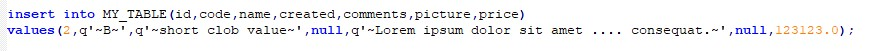

# ScriptR
PL/SQL utilitty to generate script containing list of insert statements to reproduce the contents of the specified table.

# Installation
The project can be build using Maven. The result will be appear in target directory as the name of **RibbonMenu-<version>.jar**.
```sh
sqlplus @install.sql
```
## Usage
    
### Testdata
    
Create a table:    
```sql
create table my_table(
    id       integer,
    code     varchar2(20),
    name     varchar2(100),
    created  date,
    comments clob,
    picture  blob,
    price    number);
  
  
```  

Insert some rows:
```sh
sqlplus @install.sql
```    

### Examples
    
Create script including all rows and columns
```sql
declare
    l_clob clob;
begin
    l_clob := scriptr$.getInsertScript(p_tableName => 'MY_TABLE');               
end;
/    
``` 
(testdata.sql generated this way)      
    
Create script including exclude some column
```sql
declare
    l_clob clob;
begin
    l_clob := scriptr$.getInsertScript(p_tableName => 'MY_TABLE', p_excludedCols => 'ID,PICTURE');               
end;
/    
```     
    
Create script using exclude and where clause
```sql
declare
    l_clob clob;
begin
    l_clob := scriptr$.getInsertScript(p_tableName => 'MY_TABLE', p_excludedCols => 'ID,PICTURE', p_where => 'ID=1');               
end;
/    
```   
    
## Details    
If you check generated script you can see that in simplest way the insert look like:


Text values scripted with literal quoting, the default quoting character is tilde char (overridde it using p_quotingChar parameter).    
    
If the CLOB shorter than 4000 char then no difference:

    
CLOBs longer than 4000 char scripted as concatenated chunks.
    

BLOBs scripted as concatenated RAWs: 
      

### Note
If scripted table contains many rows and/or huge LOBs, then large files can be generated. In this case consider to use Oracle Datapump instead. But if table contains long LOBs sparsely then ScriptR is a comfortable way.
    
